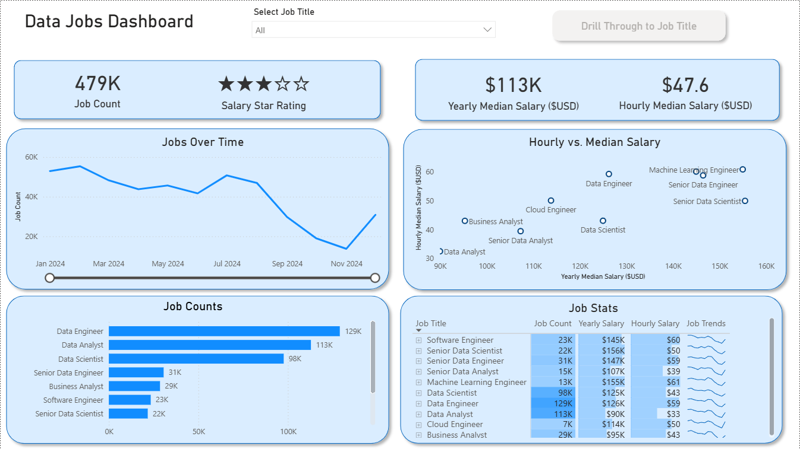
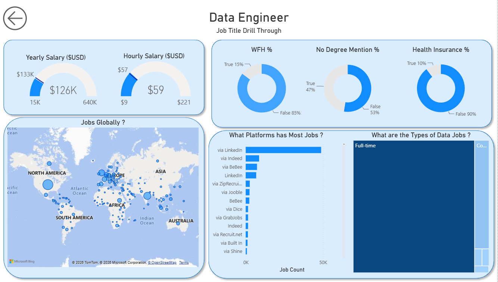

# Power BI Data Jobs Dashboard

An interactive Power BI dashboard analyzing the 2024 data jobs market, including job posting volume, salary insights, job roles, and employment characteristics.

## Dashboard Overview

## Drill-Through Analysis

The dashboard includes an interactive drill-through page that allows users to select a job title and explore detailed salary and employment insights.

## Key Insights

- The dataset contains approximately 479K data job postings from 2024.
- Data Engineer has the highest number of postings, followed by Data Analyst and Data Scientist.
- The median yearly salary across the analyzed postings is approximately $113K.
- The dashboard allows users to compare yearly and hourly salaries across different data roles.
- Drill-through functionality provides role-specific insights including salary, work-from-home availability, degree requirements, health insurance, job platforms, and employment types.

## Tools & Skills

- Power BI
- Data Visualization
- Data Analysis
- DAX
- Interactive Dashboards
- Drill-Through & Filtering

 ## Project Files

- `Data_Jobs_Dashboard_Portfolio.pbix` — Power BI project file containing the dashboard, data model, measures, and interactive functionality.
- `dashboard_overview.png` — Main dashboard overview.
- `dashboard_drillthrough.png` — Job-title drill-through dashboard.

## Project Purpose

This project was created to practice and demonstrate Power BI data analysis and dashboard development. The dashboard transforms job-posting data into an interactive report that allows users to explore job volumes, salary insights, job roles, and employment characteristics.

The project demonstrates the use of data visualization, DAX measures, filtering, slicers, and drill-through functionality to turn raw job-posting data into meaningful insights.

## Data & Methodology

The project analyzes 2024 data job postings using a dataset provided through Luke Barousse's Power BI course resources.

The dataset was analyzed in Power BI, with DAX measures used to calculate key metrics such as job counts and median salaries.

The final report was designed as an interactive dashboard with filtering and drill-through functionality, allowing users to move from an overall market view to detailed insights for individual job roles.
